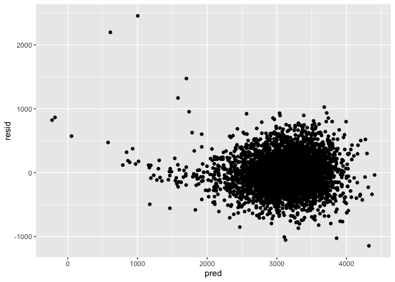
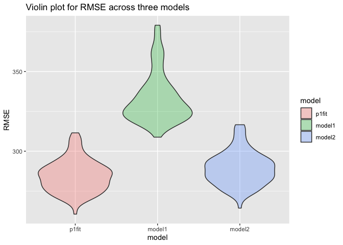

P8105\_hw6\_zc2555
================
Ziyu Chen
12/4/2021

# r set up, lodaing packages

``` r
library(tidyverse)
```

    ## ── Attaching packages ─────────────────────────────────────── tidyverse 1.3.1 ──

    ## ✓ ggplot2 3.3.5     ✓ purrr   0.3.4
    ## ✓ tibble  3.1.4     ✓ dplyr   1.0.7
    ## ✓ tidyr   1.1.3     ✓ stringr 1.4.0
    ## ✓ readr   2.0.1     ✓ forcats 0.5.1

    ## ── Conflicts ────────────────────────────────────────── tidyverse_conflicts() ──
    ## x dplyr::filter() masks stats::filter()
    ## x dplyr::lag()    masks stats::lag()

``` r
library(modelr)
```

# Problem 1, Clean the dataset, recode certain variables into factors

-   As we can see that variables: babyset, frace, malform, mrace are
    categorical data so we need to tranform them into factors.

``` r
birthweight_df = 
  read_csv("data/birthweight.csv") %>%
  janitor::clean_names() %>%
  mutate(
    babysex = recode_factor(
      as_factor(babysex), 
      "1" = "male",
      "2" = "female"),
    frace = recode_factor(
      as_factor(frace), 
      "1" = "White", 
      "2" = "Black", 
      "3" = "Asian", 
      "4" = "Puerto Rican", 
      "8" = "Other", 
      "9" = "Unknown"),
     malform = recode_factor(
       as_factor(malform), 
       "1" = "present", 
       "0" = "absent"),
     mrace = recode_factor(
       as_factor(mrace), 
       "1" = "White", 
       "2" = "Black", 
       "3" = "Asian", 
       "4" = "Puerto Rican", 
       "8" = "Other"))
```

    ## Rows: 4342 Columns: 20

    ## ── Column specification ────────────────────────────────────────────────────────
    ## Delimiter: ","
    ## dbl (20): babysex, bhead, blength, bwt, delwt, fincome, frace, gaweeks, malf...

    ## 
    ## ℹ Use `spec()` to retrieve the full column specification for this data.
    ## ℹ Specify the column types or set `show_col_types = FALSE` to quiet this message.

Check if there are any missing data

``` r
map(birthweight_df, ~sum(is.na(.)))
```

    ## $babysex
    ## [1] 0
    ## 
    ## $bhead
    ## [1] 0
    ## 
    ## $blength
    ## [1] 0
    ## 
    ## $bwt
    ## [1] 0
    ## 
    ## $delwt
    ## [1] 0
    ## 
    ## $fincome
    ## [1] 0
    ## 
    ## $frace
    ## [1] 0
    ## 
    ## $gaweeks
    ## [1] 0
    ## 
    ## $malform
    ## [1] 0
    ## 
    ## $menarche
    ## [1] 0
    ## 
    ## $mheight
    ## [1] 0
    ## 
    ## $momage
    ## [1] 0
    ## 
    ## $mrace
    ## [1] 0
    ## 
    ## $parity
    ## [1] 0
    ## 
    ## $pnumlbw
    ## [1] 0
    ## 
    ## $pnumsga
    ## [1] 0
    ## 
    ## $ppbmi
    ## [1] 0
    ## 
    ## $ppwt
    ## [1] 0
    ## 
    ## $smoken
    ## [1] 0
    ## 
    ## $wtgain
    ## [1] 0

The birth\_df is the cleaned dataset.

-   Fit a regression model

Since the outcome variable is birthweight, we might be interested in
looking at baby’s sex and it’s head circumference as well as it’s length
at birth. We also want to see the parental effect like father and
mother’s races and mother’s height on baby’s weight.

``` r
fit <- lm(bwt ~ babysex + bhead + blength + mheight + gaweeks + mrace + frace, data = birthweight_df)

fit %>% broom::tidy()
```

    ## # A tibble: 13 × 5
    ##    term              estimate std.error statistic   p.value
    ##    <chr>                <dbl>     <dbl>     <dbl>     <dbl>
    ##  1 (Intercept)       -6505.      136.    -48.0    0        
    ##  2 babysexfemale        32.3       8.63    3.75   1.81e-  4
    ##  3 bhead               137.        3.50   39.1    7.62e-287
    ##  4 blength              78.4       2.04   38.4    1.98e-277
    ##  5 mheight              10.8       1.66    6.48   9.91e- 11
    ##  6 gaweeks              12.0       1.48    8.07   9.28e- 16
    ##  7 mraceBlack         -152.       46.9    -3.24   1.21e-  3
    ##  8 mraceAsian         -113.       73.2    -1.54   1.24e-  1
    ##  9 mracePuerto Rican   -74.2      46.1    -1.61   1.07e-  1
    ## 10 fraceBlack           35.3      47.0     0.751  4.53e-  1
    ## 11 fraceAsian           40.8      70.7     0.577  5.64e-  1
    ## 12 fracePuerto Rican   -21.9      45.5    -0.480  6.31e-  1
    ## 13 fraceOther           -3.00     75.6    -0.0398 9.68e-  1

``` r
birthweight_df %>%
  modelr::add_residuals(fit) %>% 
  modelr::add_predictions(fit) %>% 
  ggplot(aes(x = pred, y = resid)) +
  geom_point()
```

<!-- --> From the
diagnostic, we can see that although there are several residual points
that are not optimal, the overall model still looks good.

-   Compare the models One using length at birth and gestational age as
    predictors (main effects only)

``` r
model_1 <- lm(bwt ~ blength + gaweeks, data = birthweight_df)

model_1 %>% broom::tidy()
```

    ## # A tibble: 3 × 5
    ##   term        estimate std.error statistic  p.value
    ##   <chr>          <dbl>     <dbl>     <dbl>    <dbl>
    ## 1 (Intercept)  -4348.      98.0      -44.4 0       
    ## 2 blength        129.       1.99      64.6 0       
    ## 3 gaweeks         27.0      1.72      15.7 2.36e-54

One using head circumference, length, sex, and all interactions
(including the three-way interaction) between these (Since length at
birth and gestational age are main effects, we also include gestational
age in our model.)

``` r
model_2 <- lm(bwt ~ bhead + blength + babysex + bhead*blength + blength*babysex + bhead*babysex + bhead*blength*babysex, data= birthweight_df)

model_2 %>% broom::tidy()
```

    ## # A tibble: 8 × 5
    ##   term                         estimate std.error statistic      p.value
    ##   <chr>                           <dbl>     <dbl>     <dbl>        <dbl>
    ## 1 (Intercept)                 -7177.     1265.       -5.67  0.0000000149
    ## 2 bhead                         182.       38.1       4.78  0.00000184  
    ## 3 blength                       102.       26.2       3.90  0.0000992   
    ## 4 babysexfemale                6375.     1678.        3.80  0.000147    
    ## 5 bhead:blength                  -0.554     0.780    -0.710 0.478       
    ## 6 blength:babysexfemale        -124.       35.1      -3.52  0.000429    
    ## 7 bhead:babysexfemale          -198.       51.1      -3.88  0.000105    
    ## 8 bhead:blength:babysexfemale     3.88      1.06      3.67  0.000245

-   Cross Validation

``` r
Cross_validation = crossv_mc(birthweight_df, 100)

  Cross_validation %>% 
  mutate(
    train = map(train, as_tibble),
    test = map(test, as_tibble)
  )
```

    ## # A tibble: 100 × 3
    ##    train                 test                .id  
    ##    <list>                <list>              <chr>
    ##  1 <tibble [3,473 × 20]> <tibble [869 × 20]> 001  
    ##  2 <tibble [3,473 × 20]> <tibble [869 × 20]> 002  
    ##  3 <tibble [3,473 × 20]> <tibble [869 × 20]> 003  
    ##  4 <tibble [3,473 × 20]> <tibble [869 × 20]> 004  
    ##  5 <tibble [3,473 × 20]> <tibble [869 × 20]> 005  
    ##  6 <tibble [3,473 × 20]> <tibble [869 × 20]> 006  
    ##  7 <tibble [3,473 × 20]> <tibble [869 × 20]> 007  
    ##  8 <tibble [3,473 × 20]> <tibble [869 × 20]> 008  
    ##  9 <tibble [3,473 × 20]> <tibble [869 × 20]> 009  
    ## 10 <tibble [3,473 × 20]> <tibble [869 × 20]> 010  
    ## # … with 90 more rows

``` r
Cross_validation = Cross_validation %>%
  mutate(
    p1_fit = map(train, ~lm(bwt ~ babysex + bhead + blength + wtgain + mheight, data = .x)), 
    model1 = map(train, ~lm(bwt ~ blength + gaweeks, data = .x)), 
    model2 = map(train, ~lm(bwt ~ bhead + blength + babysex + bhead*blength + blength*babysex + bhead*babysex + bhead*blength*babysex, data = .x))
  ) %>%
  mutate(
    rmse_p1fit = map2_dbl(p1_fit, test, ~rmse(model = .x, data = .y)),
    rmse_model1 = map2_dbl(model1, test, ~rmse(model = .x, data = .y)),
    rmse_model2 = map2_dbl(model2, test, ~rmse(model = .x, data = .y)))
```

Fitting the plots

``` r
Cross_validation %>% 
  select(starts_with("rmse")) %>% 
  pivot_longer(
    everything(),
    names_to = "model", 
    values_to = "rmse",
    names_prefix = "rmse_") %>% 
  mutate(model = fct_inorder(model)) %>% 
  ggplot(aes(x = model, y = rmse, fill = model)) + 
  geom_violin(alpha = 0.3) +
  labs(
    title = "Violin plot for RMSE across three models", 
    x = "model", 
    y = "RMSE"
  )
```

<!-- -->

# Problem 2

``` r
weather_df = 
  rnoaa::meteo_pull_monitors(
    c("USW00094728"),
    var = c("PRCP", "TMIN", "TMAX"), 
    date_min = "2017-01-01",
    date_max = "2017-12-31") %>%
  mutate(
    name = recode(id, USW00094728 = "CentralPark_NY"),
    tmin = tmin / 10,
    tmax = tmax / 10) %>%
  select(name, id, everything())
```

    ## Registered S3 method overwritten by 'hoardr':
    ##   method           from
    ##   print.cache_info httr

    ## using cached file: ~/Library/Caches/R/noaa_ghcnd/USW00094728.dly

    ## date created (size, mb): 2021-12-04 18:41:21 (7.616)

    ## file min/max dates: 1869-01-01 / 2021-12-31
